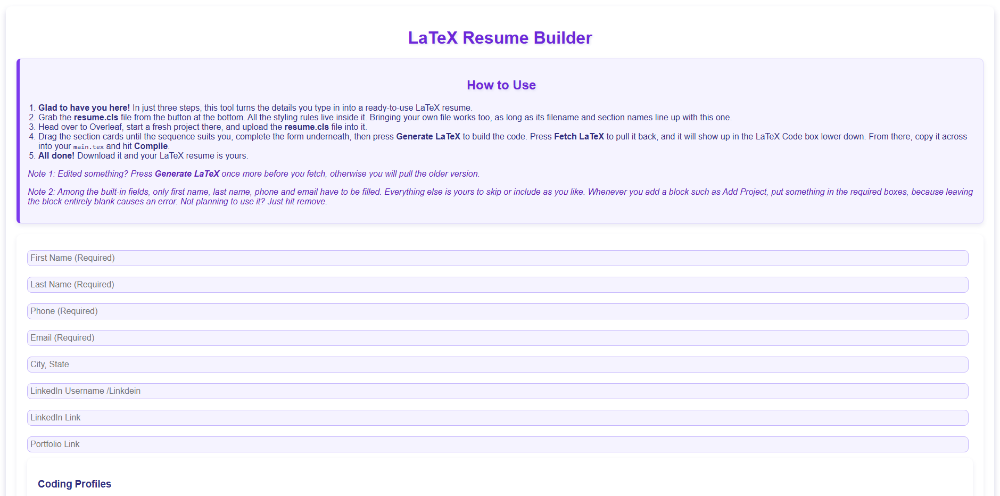

# ResumeCraft

Convert your details into an **ATS-friendly, FAANG-style resume** by generating production-ready LaTeX code — no LaTeX knowledge required.

[](https://craft-the-resume.netlify.app/)


**Live demo:** https://craft-the-resume.netlify.app/



## Why

Most resume builders export PDFs that applicant tracking systems parse badly — icon fonts, multi-column tables, and images get mangled or dropped. ResumeCraft skips that problem entirely: you fill in a plain form, and it generates clean LaTeX built on a proven ATS-safe template (`resume.cls`), so the resulting PDF is both good-looking to a recruiter and readable to a machine.

## Features

- **Form-driven input** — enter personal details, objective, education, experience, projects, skills, certifications, coding profiles, and positions of responsibility
- **Drag-and-drop section reordering** — reorder resume sections and the order is persisted to the backend
- **One-click LaTeX generation** — `Generate LaTeX` saves your data, `Fetch LaTeX` retrieves ready-to-compile code
- **Overleaf-ready template** — download the companion `resume.cls` file and compile the generated code with no local LaTeX setup
- **Multiple coding/social profiles** — GitHub, LinkedIn, portfolio, and any number of coding profiles (LeetCode, Codeforces, etc.) rendered as clickable links
- **Built-in walkthrough** — an in-app "How to Use" panel guides first-time users through the whole flow

## Tech Stack

| Layer    | Stack                                  |
| -------- | --------------------------------------- |
| Frontend | React 18, Vite, Axios, react-movable    |
| Backend  | Node.js, Express, MongoDB (Mongoose)    |
| Output   | LaTeX (`resume.cls` ATS-safe template)  |
| Deploy   | Netlify (frontend) · Render (backend)   |

## How It Works

1. Fill in the form — only first name, last name, phone, and email are required; everything else is optional.
2. Drag section cards (Experience, Education, Skills, Projects, Certifications, ...) into the order you want them to appear on the resume.
3. Click **Generate LaTeX** to save your data, then **Fetch LaTeX** to pull back the compiled LaTeX.
4. Download the **resume.cls** template and start a new project on [Overleaf](https://www.overleaf.com/).
5. Paste the generated code into `main.tex` next to `resume.cls`, hit Compile, and download your PDF.

## Project Structure

```
frontend/my-react-app/   React + Vite SPA
backend/                 Express API (server.js, app.js) + Mongoose models
netlify.toml             Frontend build config (Netlify)
render.yaml              Backend deploy config (Render)
```

## API Overview

| Method | Route              | Description                                  |
| ------ | ------------------ | --------------------------------------------- |
| GET    | `/health`           | Health check (used by Render)                |
| POST   | `/users`            | Save resume data                             |
| POST   | `/api/save-order`   | Persist the drag-and-drop section order      |
| GET    | `/generate-latex`   | Generate and download the `.tex` file        |

## Getting Started

**Prerequisites:** Node.js 18+, a MongoDB connection string

```bash
git clone https://github.com/drsn-ajani/resumecraft
cd resumecraft
```

**Backend**

```bash
cd backend
npm install
npm start          # http://localhost:5000
```

Create `backend/.env`:

```
PORT=5000
MONGO_URI=your_mongodb_connection_string
FRONTEND_URL=http://localhost:5173
```

**Frontend**

```bash
cd frontend/my-react-app
npm install
npm run dev        # http://localhost:5173
```

If your backend isn't running on `http://localhost:5000`, create `frontend/my-react-app/.env`:

```
VITE_API_URL=http://localhost:5000
```

## Roadmap

- [ ] Multiple resume templates
- [ ] In-browser PDF rendering / live preview
- [ ] CSV import/export of resume data
- [ ] Save/load resumes to an account

## License

All rights reserved. This code is public for viewing/reference only — no license is granted to use, copy, modify, or redistribute it without permission.

## Author

**Darshan Ajani** — [GitHub](https://github.com/drsn-ajani) · [LinkedIn](https://www.linkedin.com/in/darshan-ajani-55b1b524a)
